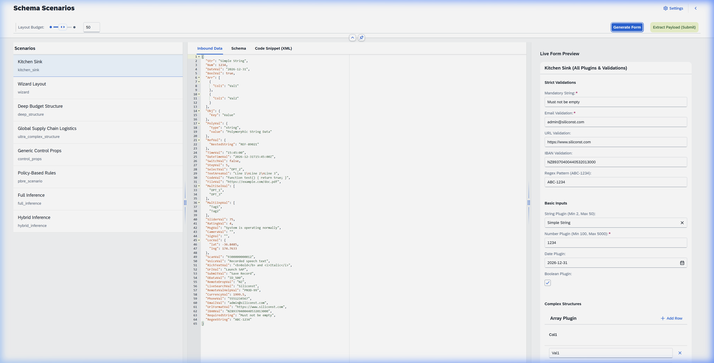

# MetaUI

**MetaUI** is an extensible, metadata-driven UI engine built on top of SAP UI5. Instead of relying on static XML views, it parses standard JSON Schema definitions at runtime to dynamically generate SAP Fiori component trees. This enables server-driven architectures where the UI structure and data bindings are determined entirely by the incoming payload.

[](https://SiliconStreetDev1.github.io/MetaUI/index.html)
[](LICENSE)



## MetaUI vs. Fiori Elements

It is important to note that MetaUI is **not** an attempt to replace SAP Fiori Elements. Fiori Elements is a robust framework for building UIs driven by static OData CDS annotations. 

MetaUI is designed as a complementary tool for highly dynamic use cases where CDS annotations are unavailable, impossible, or too rigid. By relying on universal JSON Schema, MetaUI provides a flexible alternative for scenarios that demand on-the-fly, runtime layout generation.

## Quickstart

**1. Install**
```bash
npm install @siliconst/metaui
```

**2. Add to your XML View**
```xml
<meta:DynamicHost
    schemaDefinition="{yourModel>/schema}"
    data="{yourModel>/payload}"
    submit=".onFormSubmitted"
/>
```

**3. Define a schema** (or let MetaUI infer one from your data)
```json
{
  "title": "Guest Registration",
  "type": "object",
  "properties": {
    "FullName":   { "type": "string", "maxLength": 100 },
    "Email":      { "type": "string", "ui": { "format": "email" } },
    "CheckIn":    { "type": "date" },
    "VIP":        { "type": "boolean", "ui": { "widget": "switch" } }
  },
  "required": ["FullName", "Email"]
}
```

That's it. MetaUI handles the `sap.m.Input`, `sap.m.DatePicker`, `sap.m.Switch`, validation, labels, and responsive layout automatically.

## Key Features

- **31 field plugins** — Strings, dates, cameras, barcode scanners, signatures, code editors, and more
- **4 layout strategies** — Form, Table, Wizard (step-by-step), Compact
- **Policy-Based Rules Engine** — Declarative cross-field logic (Show/Hide/Require/Disable) with automatic symmetrical reversals
- **Tri-Binding Engine** — Feed data as an object, JSON string, or OData context
- **Full Inference Mode** — Pass raw data with no schema; MetaUI generates the UI automatically
- **OpenAPI / Swagger support** — Extract schemas directly from API specs

## 📚 Documentation

Full documentation covering schemas, plugins, policies, and integration guides:

**→ [MetaUI Documentation Wiki](docs/wiki/Home.md)**

## ⚖️ License

MIT — see [LICENSE](LICENSE) for details.

> **Disclaimer**: This software is provided "as is", without warranty of any kind. Use at your own risk.
