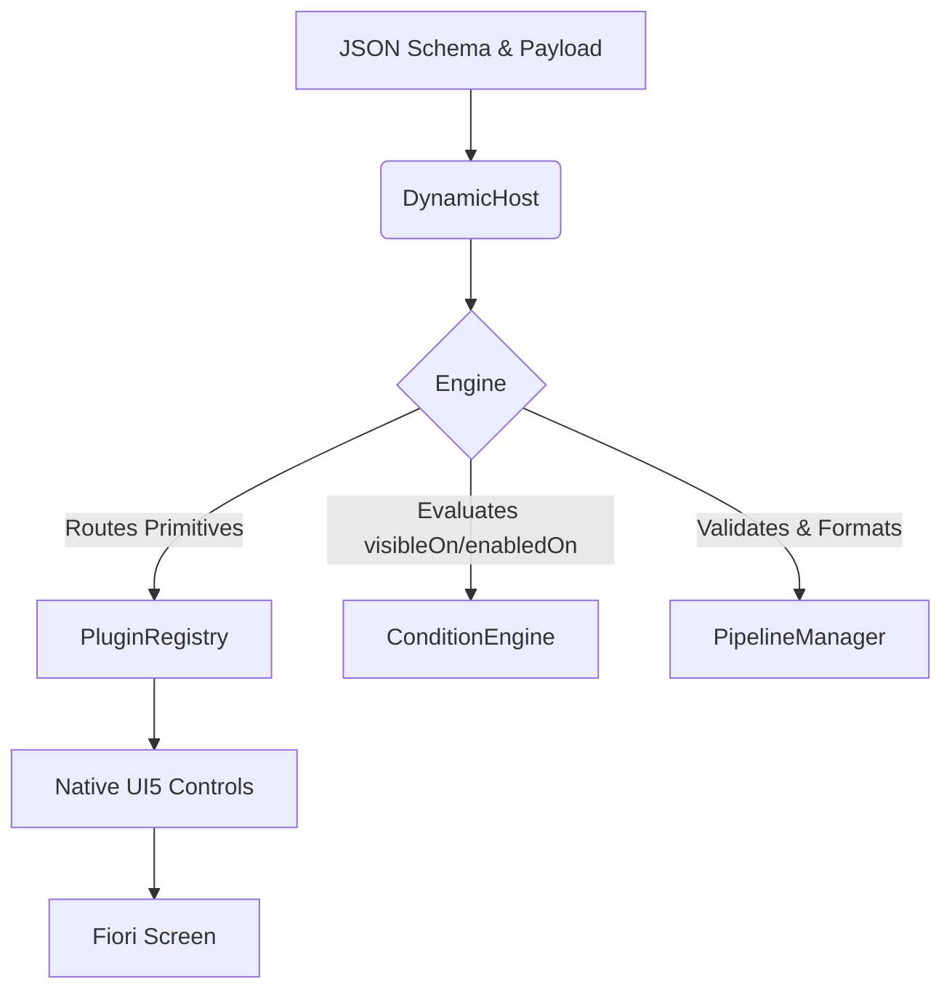

# 01. Getting Started

MetaUI is a plugin-driven JSON-schema rendering engine for SAP UI5. Instead of relying on static XML views, it parses standard JSON Schema definitions at runtime to dynamically generate SAP Fiori component trees, enabling fully server-driven architectures.

## Architecture Overview

## Engine Modes

MetaUI operates in three distinct inference modes depending on how you define your schema:

1. **Strict Whitelist Mode (Default)**: If you provide a full `schemaDefinition`, the engine strictly renders *only* the properties you define. Any extra fields in your data payload are ignored.
2. **100% Inference Mode**: If you omit the `schemaDefinition` entirely, the engine infers a schema from your data payload on the fly, rendering standard text inputs, checkboxes, and number fields.
3. **Hybrid Partial Mode**: If you provide a minimal schema with `"additionalProperties": true`, the engine will recursively deep-merge your custom UI directives (e.g. converting a string to a Dropdown) with an automatically inferred baseline from your data payload.



## Data Binding & Payload Extraction
MetaUI natively maps to standard UI5 OData or JSON Models. It provides 4 primary ways to manage your payload state, including live two-way extraction and OData context binding. See **[08. Data Binding Architecture](08_data_binding.md)** for detailed implementation examples.

## Installation

Install the package via npm:

```bash
npm install nz.co.siliconst.ui5.metaui
```

## Basic Initialization (JavaScript)

The core control is the `DynamicHost`. It requires two properties:
1. `schemaDefinition`: The JSON Schema defining the fields.
2. `data`: The runtime data payload.

```javascript
sap.ui.require(["nz/co/siliconst/ui5/metaui/controls/DynamicHost"], function (DynamicHost) {
    
    // 1. Define the schema
    const schema = {
        type: "object",
        properties: {
            Username: { type: "string", ui: { label: "User Name" } },
            IsActive: { type: "boolean", ui: { label: "Active Status" } }
        }
    };

    // 2. Define the payload
    const data = {
        Username: "Developer",
        IsActive: true
    };

    // 3. Instantiate the host
    const host = new DynamicHost({
        schemaDefinition: schema,
        data: data,
        editable: true, // Set to false to render the form as a read-only native Display view
        debugMode: true // Enables visible error popups and detailed console logging for troubleshooting
    });

    // 4. Open the form in a Dialog
    host.openInDialog("User Configuration", "OK");

    // 5. Listen for the payload extraction on submit
    host.attachSubmit(function(oEvent) {
        const payload = oEvent.getParameter("payload");
        console.log("Updated data:", payload);
    });

});
```

When `openInDialog` is called, the engine processes the schema and natively generates a `sap.ui.layout.form.SimpleForm` with a bound `sap.m.Input` and `sap.m.Switch`.

## DynamicHost API Properties

The `DynamicHost` exposes the following configuration properties (which can be set in XML or programmatically):

| Property | Type | Default | Description |
|---|---|---|---|
| `schemaDefinition` | `object` | `null` | The JSON Schema defining the fields. If omitted, the engine infers fields from the payload. |
| `data` | `object` | `null` | The runtime data payload. Can be bound to OData or JSON models natively. |
| `dataJson` | `string` | `null` | A stringified version of the payload, useful for REST services returning flat strings. |
| `editable` | `boolean` | `true` | When `true`, fields render as Inputs, Switches, etc. When `false`, the entire form renders as read-only display fields (e.g., `sap.m.Text`). |
| `liveUpdate` | `boolean` | `false` | If `true`, any change in a field immediately fires the `submit` / `fieldChange` events, enabling live extraction without a submit button. |
| `useMessageManager`| `boolean` | `false` | Natively integrates with the UI5 `MessageManager` to highlight validation errors directly on the inputs using ValueStates. |
| `modelName` | `string` | `"meta"` | The internal UI5 model namespace used by the `StateManager`. You rarely need to change this. |
| `debugMode` | `boolean` | `false` | Enables verbose console logging and triggers a `MessageBox` stack trace on critical errors instead of silent failure. |
| `isValid` | `boolean` | `true` | A read-only boolean reflecting the real-time validity of the current form data against the schema. |

## Next Steps

While opening in a dialog is great for quick scripts, you'll likely want to embed the engine directly into a standard Fiori XML View. 

**Continue to [02. Fiori App Integration](02_fiori_app_integration.md)** to see how to properly configure your `ui5.yaml` and inject `<DynamicHost>` into an XML view.
